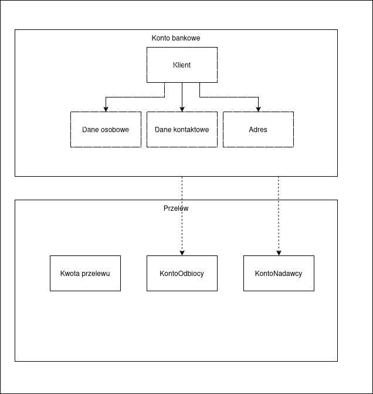

# Domain Driven Design

W ramach zadania należało przedstawić zgodnie z zasadą Domain Driven Design fragment bezpiecznej aplikacji bankowej.

## Bounded Context:

| Nazwa              | Opis                                                                                           |
| ------------------ | ---------------------------------------------------------------------------------------------- |
| Zarządzanie Kontem | Odpowiada za tworzenie i edytowanie danych kont bankowych klientów                             |
| Przelewy           | Odpowiada za zlecenia przelewów, weryfikuje saldo                                              |
| Karty              | Odpowiada za zarządzanie kartami klientów, wydawanie kart, ustawianie limitów, blokowania kart |
| Kredyty            | Odpowiada za zlecanie kredytów, wyświetla obecne raty                                          |
| Uwierzytelnienie   | Odpowiada za proces logowania i autoryzacji klientów                                           |

## Agregaty:

| Nazwa        | Powiązane obiekty wartości / encje         | Opis                                          |
| ------------ | ------------------------------------------ | --------------------------------------------- |
| KontoBankowe | Klient, Saldo                              | Reprezentuje indywidualne konto klienta banku |
| Przelew      | KwotaPrzelewu, KontoOdbiorcy, KontoNadawcy | Reprezentuje zlecenie przelewu                |

## Encje

### Klient

| Atrybut        | Typ danych     | Opis                           |
| -------------- | -------------- | ------------------------------ |
| idKlienta      | String         | Unikalny identyfikator klienta |
| daneOsobowe    | daneOsobowe    | Dane osobowe klienta           |
| daneKontaktowe | daneKontatkowe | Dane kontaktowe klienta        |
| adres          | Adres          | Adres zamieszkania klienta     |

### KontoBankowe

| Atrybut    | Typ danych | Opis                                           |
| ---------- | ---------- | ---------------------------------------------- |
| idKonta    | String     | Unikalny identyfikator konta                   |
| idKlienta  | String     | Identyfikator klienta, do którego należy konto |
| numerKonta | String     | Numer konta bankowego klienta                  |
| saldo      | Decimal    | Aktualne saldo konta                           |

### Przelew

| Atrybut      | Typ danych                                | Opis                                     |
| ------------ | ----------------------------------------- | ---------------------------------------- |
| idPrzelewu   | String                                    | Unikalny identyfikator przelewu          |
| kwota        | KwotaPrzelewu                             | Kwota oraz waluta przelewu               |
| dataZlecenia | DateTime                                  | Data zlecenia przelewu                   |
| nadawca      | KontoBankowe                              | Konto, z którego wykonywany jest przelew |
| odbiorca     | KontoBankowe                              | Konto, na które wykonany jest przelew    |
| tytul        | String                                    | Tytuł przelewu podany przez nadawcę      |
| status       | Enum(Oczekujący, Zrealizowany, Odrzucony) | Status przetwarzania przelewu            |

## Obiekty wartości

### Dane osobowe

| Atrybut  | Typ danych | Opis             |
| -------- | ---------- | ---------------- |
| imie     | String     | Imię klienta     |
| nazwisko | String     | Nazwisko klienta |

### Dane kontaktowe

| Atrybut       | Typ danych | Opis                        |
| ------------- | ---------- | --------------------------- |
| email         | String     | Adres e-mail klienta        |
| numerTelefonu | String     | Numer telefonu kontaktowego |

### Adres

| Atrybut     | Typ danych | Opis         |
| ----------- | ---------- | ------------ |
| ulica       | String     | Nazwa ulicy  |
| numerUlicy  | String     | Numer ulicy  |
| miasto      | String     | Nazwa miasta |
| kodPocztowy | String     | Kod pocztowy |
| kraj        | String     | Nazwa kraju  |

### KwotaPrzelewu

| Atrybut | Typ danych               | Opis                                      |
| ------- | ------------------------ | ----------------------------------------- |
| wartość | Decimal                  | Kwota przelewu                            |
| waluta  | Enum(PLN, EUR, USD, ...) | Waluta, w której realizowany jest przelew |

## Model

